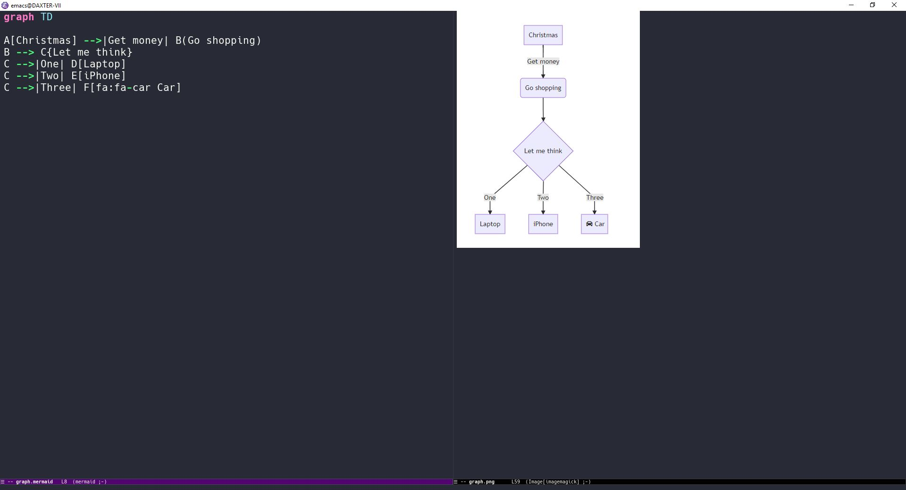
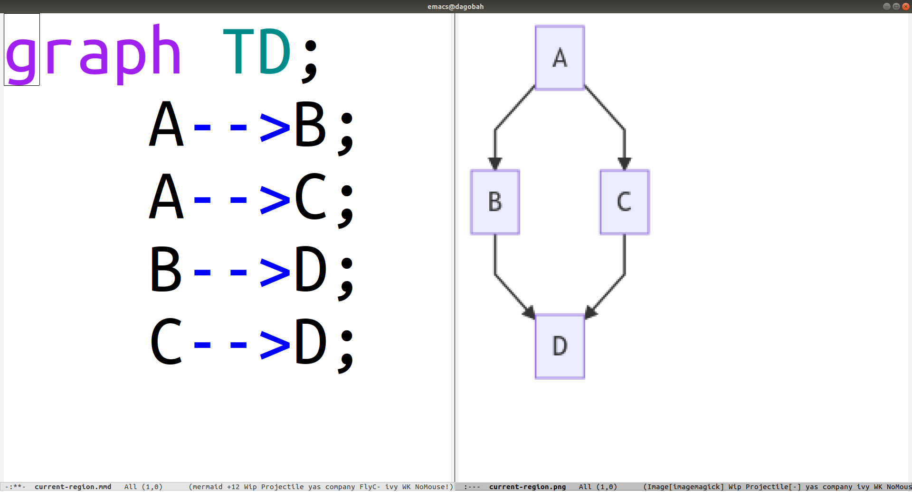

[](https://melpa.org/#/mermaid-mode)

# mermaid-mode

Emacs major mode for working with [mermaid graphs](https://mermaid-js.github.io/)



[](https://vimeo.com/414458581 "Screencast")

## Installation

1. Install from Melpa or load the `mermaid-mode.el` file
1. Install `mmdc` binary from the [mermaid-cli project](https://github.com/mermaid-js/mermaid-cli) if you plan to compile graphs in Emacs

## Usage

Currently supporting flow charts and sequence diagrams with syntax coloring and indentation.

```text
C-c C-c - compile current file to an image
C-c C-f - compile given file to an image
C-c C-b - compile current buffer to an image
C-c C-r - compile current region to an image
C-c C-o - open in the live editor
C-c C-d - open the official doc
```
Note: All compile commands will open the output in a buffer to view the resulting image.

## Customization

### `mmdc` location
You can specify the location of `mmdc` with the variable `mermaid-mmdc-location`, the default assumes you have the binary in your `PATH` (and for that you probably want/need to install [`mermaid-cli`](https://github.com/mermaid-js/mermaid-cli)).

### Output format
By default `mmdc` will compile to png format. You can change that by setting the variable `mermaid-output-format`.

### Temp directory
By default `mermaid-tmp-dir` points to `\tmp\`. Feel free to set it to a more appropriate location that works for you (e.g. on windows).

### Key bindings
To customize the key bindings but this into your `init.el` ...

```elisp
(setq mermaid-mode-map
  (let ((map mermaid-mode-map))
    (define-key map (kbd "C-c C-c") nil)
    (define-key map (kbd "C-c C-f") nil)
    (define-key map (kbd "C-c C-b") nil)
    (define-key map (kbd "C-c C-r") nil)
    (define-key map (kbd "C-c C-o") nil)
    (define-key map (kbd "C-c C-d") nil)
    (define-key map (kbd "C-c C-d c") 'mermaid-compile)
    (define-key map (kbd "C-c C-d c") 'mermaid-compile)
    (define-key map (kbd "C-c C-d f") 'mermaid-compile-file)
    (define-key map (kbd "C-c C-d b") 'mermaid-compile-buffer)
    (define-key map (kbd "C-c C-d r") 'mermaid-compile-region)
    (define-key map (kbd "C-c C-d o") 'mermaid-open-browser)
    (define-key map (kbd "C-c C-d d") 'mermaid-open-doc)
    map))
```

### mermaid-cli in Docker 
To render mermaid charts without needing to install nodejs+mermaid-cli, you can use the [docker image](ghcr.io/mermaid-js/mermaid-cli/mermaid-cli) and set your location and flags:

```
(setq mermaid-mmdc-location "docker")
(setq mermaid-flags "run -u 1000 -v /tmp:/tmp ghcr.io/mermaid-js/mermaid-cli/mermaid-cli:9.1.6")
```

- `-u 1000` ensures that the resulting output png file has a matching UID to the current user, avoiding permissions issues when deleting or overwriting the png. Please set the UID value that works for your local machine.
- `-v /tmp:/tmp` mounts the host `/tmp` to `/tmp` inside the container. This ensures that mmdc inside the container will be reading/writing to the host `/tmp` when rendering.
- `9.1.6`: Latest stable version as of this writing. Can check available tags [here](https://github.com/mermaid-js/mermaid-cli/pkgs/container/mermaid-cli%2Fmermaid-cli/versions?filters%5Bversion_type%5D=tagged)

## Bugs & Issues

Feel free to open an issue!
